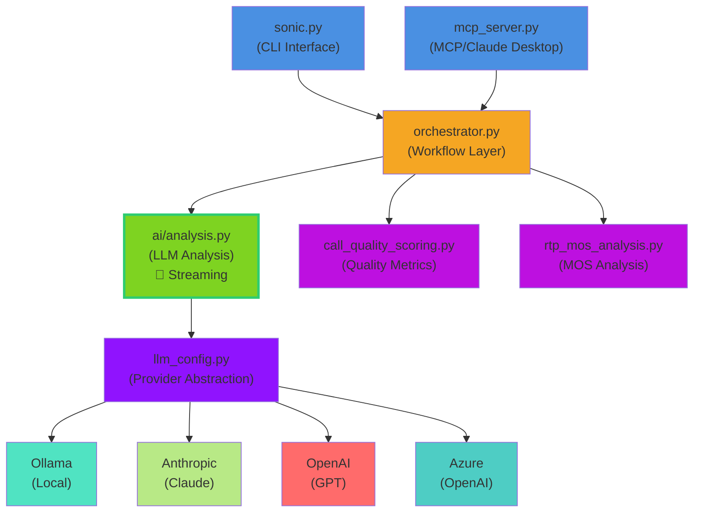
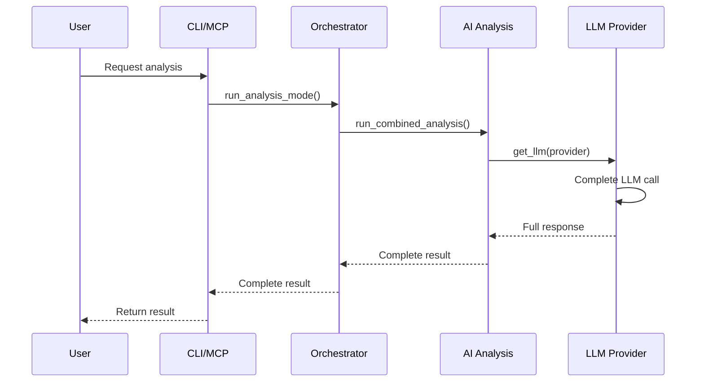
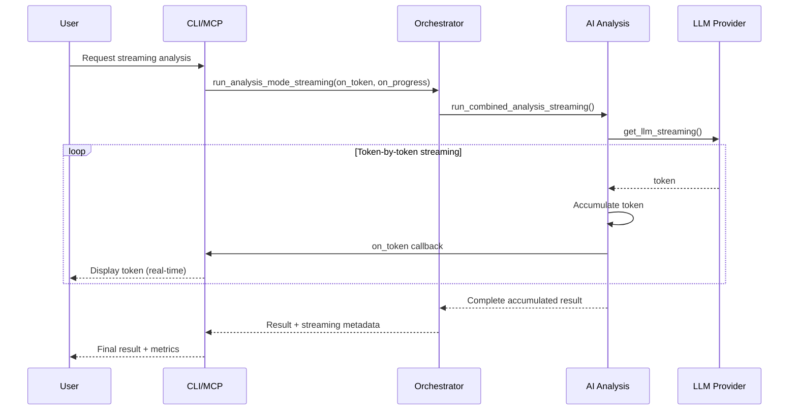

# S.O.N.I.C. MCP Integration + Multi-Provider LLM Support

## Overview

Add FastMCP server integration to expose S.O.N.I.C. analysis as tools for AI assistants (Claude Desktop, Cline, etc.) AND enable support for multiple LLM providers (Anthropic, OpenAI, Azure) beyond just Ollama.

**Current State**: Hardcoded to `ollama/qwen2.5` models only  
**Target State**: Provider-agnostic with MCP tool interface

---

## Implementation Steps

### 1. Create LLM Provider Abstraction (`llm_config.py`)

**Location**: `/home/noot/sonic/llm_config.py`

**Purpose**: Centralized LLM configuration and provider abstraction

**Implementation**:

```python
#!/usr/bin/env python3
"""
S.O.N.I.C. LLM Configuration Module

Provides provider-agnostic LLM configuration for DSPy.
Supports: Ollama (local), Anthropic, OpenAI, Azure
"""

import os
from typing import Optional
import dspy


class LLMConfig:
    """Configuration for LLM providers"""
    
    PROVIDER_MODELS = {
        "ollama": {
            "fast": "qwen2.5:0.5b",
            "detailed": "qwen2.5vl:7b"
        },
        "anthropic": {
            "fast": "claude-3-5-haiku-20241022",
            "detailed": "claude-3-5-sonnet-20241022"
        },
        "openai": {
            "fast": "gpt-4o-mini",
            "detailed": "gpt-4o"
        },
        "azure": {
            "fast": "gpt-4o-mini",  # Uses deployment name from env
            "detailed": "gpt-4o"
        }
    }
    
    def __init__(self, provider: str = None, model_name: str = None, api_key: str = None):
        self.provider = provider or os.getenv("SONIC_LLM_PROVIDER", "ollama")
        self.model_name = model_name
        self.api_key = api_key or self._get_api_key()
        self.temperature = float(os.getenv("SONIC_LLM_TEMPERATURE", "0.7"))
        self.max_tokens = int(os.getenv("SONIC_LLM_MAX_TOKENS", "4000"))
    
    def _get_api_key(self) -> Optional[str]:
        """Get API key from environment based on provider"""
        if self.provider == "anthropic":
            return os.getenv("ANTHROPIC_API_KEY")
        elif self.provider == "openai":
            return os.getenv("OPENAI_API_KEY")
        elif self.provider == "azure":
            return os.getenv("AZURE_OPENAI_KEY")
        return None
    
    def get_model_name(self, profile: str = "fast") -> str:
        """Get model name for provider and profile"""
        if self.model_name:
            return self.model_name
        
        if profile not in ["fast", "detailed"]:
            profile = "fast"
        
        return self.PROVIDER_MODELS.get(self.provider, {}).get(profile, "qwen2.5:0.5b")


def get_llm(profile: str = "fast", provider: str = None, model_name: str = None, api_key: str = None) -> dspy.LM:
    """
    Factory function to create configured DSPy LM instance.
    
    Args:
        profile: "fast" or "detailed" - determines model selection
        provider: LLM provider (ollama, anthropic, openai, azure)
        model_name: Override model name (optional)
        api_key: API key for cloud providers (optional, prefers env var)
    
    Returns:
        Configured dspy.LM instance
    
    Examples:
        >>> lm = get_llm("fast", "ollama")  # Local qwen2.5:0.5b
        >>> lm = get_llm("detailed", "anthropic")  # Claude Sonnet
        >>> lm = get_llm("fast", "openai")  # GPT-4o-mini
    """
    config = LLMConfig(provider, model_name, api_key)
    model = config.get_model_name(profile)
    
    # Format model string for DSPy
    if config.provider == "ollama":
        model_str = f"ollama/{model}"
    elif config.provider == "anthropic":
        model_str = f"anthropic/{model}"
    elif config.provider == "openai":
        model_str = f"openai/{model}"
    elif config.provider == "azure":
        model_str = f"azure/{model}"
    else:
        # Fallback to ollama
        model_str = f"ollama/{model}"
    
    # Create LM instance
    lm_kwargs = {
        "model": model_str,
        "temperature": config.temperature,
        "max_tokens": config.max_tokens
    }
    
    # Add API key if needed
    if config.api_key:
        lm_kwargs["api_key"] = config.api_key
    
    return dspy.LM(**lm_kwargs)


def list_available_providers():
    """Return dict of available providers and their models"""
    return {
        "providers": list(LLMConfig.PROVIDER_MODELS.keys()),
        "models": LLMConfig.PROVIDER_MODELS,
        "default": "ollama"
    }
```

---

### 2. Update `ai/analysis.py`

**Changes**:
- Import `from llm_config import get_llm`
- Replace line 117: `fast_lm = dspy.LM(model="ollama/qwen2.5:0.5b", temperature=0.7, max_tokens=4000)`
  - With: `fast_lm = get_llm(profile="fast", provider=provider)`
- Replace line 122: `detailed_lm = dspy.LM(model="ollama/qwen2.5vl:7b", temperature=0.7, max_tokens=4000)`
  - With: `detailed_lm = get_llm(profile="detailed", provider=provider)`
- Add `provider` parameter to `run_combined_analysis()` function signature

**Modified function signature**:
```python
def run_combined_analysis(file_content: str, file_path: str = None, provider: str = None) -> Dict[str, Any]:
```

---

### 3. Update `analyzers/orchestrator.py`

**Changes**:
- Import `from llm_config import get_llm`
- Add `provider` parameter to `run_analysis_mode()` function (line ~28)
- Replace line 60: `fast_lm = dspy.LM(...)`
  - With: `fast_lm = get_llm("fast", provider)`
- Replace line 64: `detailed_lm = dspy.LM(...)`
  - With: `detailed_lm = get_llm("detailed", provider)`
- Replace line 135: `lm = dspy.LM(model=f"ollama/{model_name}", ...)`
  - With: `lm = get_llm("fast", provider, model_name=model_name)`
- Pass `provider` to `run_combined_analysis()` call

**Modified function signature**:
```python
def run_analysis_mode(file_path: str, model_mode: str, enable_quality: bool = False, enable_mos: bool = False, provider: str = None) -> Dict[str, Any]:
```

---

### 4. Update `sonic.py` CLI

**Changes to argument parser** (after line 66):

```python
parser.add_argument(
    "--provider",
    choices=["ollama", "anthropic", "openai", "azure"],
    default="ollama",
    help="LLM provider: ollama (local/free), anthropic (Claude), openai (GPT), azure"
)

parser.add_argument(
    "--model-name",
    help="Override default model name for the provider (advanced users)"
)

parser.add_argument(
    "--api-key",
    help="API key for cloud providers (optional, prefers environment variable)"
)
```

**Update function calls**:
- Line 105: `run_quality_only_analysis(args.file, args.save_file, enable_mos=True, enable_quality=True)` (no change, doesn't use LLM)
- Line 109: Add `provider=args.provider` parameter:
  ```python
  result = run_analysis_mode(args.file, args.model, enable_quality=args.quality, enable_mos=args.mos, provider=args.provider)
  ```

**Update help text examples** (lines 35-47):
```python
Examples:
  # Local analysis with Ollama (default)
  %(prog)s --file capture.pcapng --model combined
  
  # Use Anthropic Claude
  %(prog)s --file capture.pcapng --provider anthropic --model fast
  
  # Use OpenAI GPT-4
  %(prog)s --file capture.pcapng --provider openai --model detailed
  
  # Quality-only analysis (no LLM needed)
  %(prog)s --file capture.pcapng --quality-only
```

---

### 5. Create `mcp_server.py`

**Location**: `/home/noot/sonic/mcp_server.py`

**Full implementation**:

```python
#!/usr/bin/env python3
"""
S.O.N.I.C. MCP Server

FastMCP server exposing S.O.N.I.C. VoIP analysis as tools for AI assistants.
Works with Claude Desktop, Cline, and other MCP clients.

Usage:
    python3 mcp_server.py

Configure in Claude Desktop mcp.json:
    {
      "mcpServers": {
        "sonic": {
          "command": "python3",
          "args": ["/home/noot/sonic/mcp_server.py"],
          "env": {
            "SONIC_LLM_PROVIDER": "anthropic"
          }
        }
      }
    }
"""

import os
import sys
import json
from pathlib import Path
from typing import Dict, Any

from fastmcp import FastMCP

# Add parent directory to path to import sonic modules
sys.path.insert(0, os.path.dirname(os.path.abspath(__file__)))

from analyzers.orchestrator import run_analysis_mode
from extractors.tshark import extract_sip_data
from analyzers.call_quality_scoring import CallQualityScorer
from analyzers.rtp_mos_analysis import AdvancedRTPMOSAnalyzer
from llm_config import list_available_providers

# Create MCP server
mcp = FastMCP("S.O.N.I.C. VoIP Analyzer")


@mcp.tool()
def analyze_pcap(
    file_path: str,
    provider: str = "ollama",
    model: str = "combined",
    enable_quality: bool = True,
    enable_mos: bool = True
) -> Dict[str, Any]:
    """
    Analyze a VoIP packet capture file for call quality issues.
    
    Args:
        file_path: Absolute path to pcap/pcapng file on disk
        provider: LLM provider (ollama, anthropic, openai, azure)
        model: Analysis mode (fast, detailed, combined)
        enable_quality: Include call quality scoring
        enable_mos: Include MOS (Mean Opinion Score) analysis
    
    Returns:
        JSON with diagnostic report, quality analysis, and recommendations
    
    Example:
        analyze_pcap("/path/to/capture.pcapng", provider="anthropic", model="fast")
    """
    try:
        # Validate file exists
        if not os.path.exists(file_path):
            return {
                "status": "error",
                "error": f"File not found: {file_path}"
            }
        
        if not os.access(file_path, os.R_OK):
            return {
                "status": "error",
                "error": f"File not readable: {file_path}"
            }
        
        # Run analysis
        result = run_analysis_mode(
            file_path=file_path,
            model_mode=model,
            enable_quality=enable_quality,
            enable_mos=enable_mos,
            provider=provider
        )
        
        return result
        
    except Exception as e:
        return {
            "status": "error",
            "error": str(e),
            "type": type(e).__name__
        }


@mcp.tool()
def quick_quality_check(file_path: str) -> Dict[str, Any]:
    """
    Fast quality-only analysis without AI model inference.
    
    Provides MOS scores, quality grades, and network metrics.
    No LLM required - analyzes RTP streams directly.
    
    Args:
        file_path: Absolute path to pcap/pcapng file on disk
    
    Returns:
        JSON with quality score, grade, MOS analysis, network metrics
    
    Example:
        quick_quality_check("/path/to/capture.pcapng")
    """
    try:
        # Validate file
        if not os.path.exists(file_path):
            return {"status": "error", "error": f"File not found: {file_path}"}
        
        # Extract SIP data
        sip_data = extract_sip_data(file_path)
        if not sip_data:
            return {"status": "error", "error": "No SIP data found in capture"}
        
        results = {"status": "success", "file": file_path}
        
        # Run quality scoring
        try:
            quality_scorer = CallQualityScorer()
            quality_result = quality_scorer.score_call_quality(sip_data, [], None, file_path)
            results["quality_analysis"] = quality_result
        except Exception as e:
            results["quality_error"] = str(e)
        
        # Run MOS analysis
        try:
            mos_analyzer = AdvancedRTPMOSAnalyzer()
            mos_result = mos_analyzer.analyze_rtp_streams(sip_data, file_path)
            results["mos_analysis"] = mos_result
        except Exception as e:
            results["mos_error"] = str(e)
        
        return results
        
    except Exception as e:
        return {
            "status": "error",
            "error": str(e),
            "type": type(e).__name__
        }


@mcp.tool()
def list_llm_providers() -> Dict[str, Any]:
    """
    List available LLM providers and their model options.
    
    Returns:
        JSON with provider list, model mappings, and current configuration
    
    Example:
        list_llm_providers()
    """
    try:
        providers = list_available_providers()
        
        # Add current config
        providers["current_config"] = {
            "provider": os.getenv("SONIC_LLM_PROVIDER", "ollama"),
            "anthropic_key_set": bool(os.getenv("ANTHROPIC_API_KEY")),
            "openai_key_set": bool(os.getenv("OPENAI_API_KEY"))
        }
        
        return providers
        
    except Exception as e:
        return {
            "status": "error",
            "error": str(e)
        }


if __name__ == "__main__":
    # Run MCP server
    mcp.run()
```

---

### 6. Update `requirements.txt`

Add these lines:

```
# MCP Server Integration
fastmcp>=0.2.0

# Optional: Cloud LLM Provider SDKs
# Uncomment if using Anthropic Claude:
# anthropic>=0.18.0

# Uncomment if using OpenAI GPT:
# openai>=1.0.0
```

---

### 7. Create `.env.example`

**Location**: `/home/noot/sonic/.env.example`

```bash
# S.O.N.I.C. LLM Provider Configuration

# Provider Selection (ollama/anthropic/openai/azure)
SONIC_LLM_PROVIDER=ollama

# Model Overrides (optional)
# SONIC_LLM_FAST_MODEL=qwen2.5:0.5b
# SONIC_LLM_DETAILED_MODEL=qwen2.5vl:7b

# Model Parameters
SONIC_LLM_TEMPERATURE=0.7
SONIC_LLM_MAX_TOKENS=4000

# API Keys for Cloud Providers
# Only needed if using anthropic/openai/azure providers

# Anthropic Claude API Key
# Get from: https://console.anthropic.com/
# ANTHROPIC_API_KEY=sk-ant-api03-...

# OpenAI API Key  
# Get from: https://platform.openai.com/api-keys
# OPENAI_API_KEY=sk-...

# Azure OpenAI
# AZURE_OPENAI_KEY=...
# AZURE_OPENAI_ENDPOINT=https://your-resource.openai.azure.com/
```

---

### 8. Create `mcp.json` Example

**Location**: `/home/noot/sonic/mcp.json.example`

```json
{
  "mcpServers": {
    "sonic-voip-analyzer": {
      "command": "python3",
      "args": ["/home/noot/sonic/mcp_server.py"],
      "env": {
        "SONIC_LLM_PROVIDER": "anthropic",
        "ANTHROPIC_API_KEY": "your-api-key-here"
      }
    }
  }
}
```

**Installation instructions in comments**:
```jsonc
// For Claude Desktop:
// 1. Copy this to: ~/.config/Claude/claude_desktop_config.json (Linux)
//    or: ~/Library/Application Support/Claude/claude_desktop_config.json (Mac)
// 2. Update the args path to your actual sonic directory
// 3. Set ANTHROPIC_API_KEY or use environment variable
// 4. Restart Claude Desktop

// For Cline VSCode Extension:
// 1. Open Cline settings
// 2. Add MCP server with command: python3 /home/noot/sonic/mcp_server.py
// 3. Configure environment variables in Cline settings
```

---

### 9. Update README.md

Add these sections after "Usage Examples":

```markdown
## 🔌 Multi-Provider LLM Support

S.O.N.I.C. supports multiple LLM providers for analysis:

### Supported Providers

| Provider | Models | Cost | Setup |
|----------|--------|------|-------|
| **Ollama** (default) | qwen2.5:0.5b, qwen2.5vl:7b | Free | Local installation |
| **Anthropic** | Claude 3.5 Haiku, Sonnet | ~$0.01-0.03/call | API key required |
| **OpenAI** | GPT-4o-mini, GPT-4o | ~$0.01-0.05/call | API key required |
| **Azure** | GPT models via Azure | Varies | Azure OpenAI setup |

### Configuration

**Option 1: Environment Variables**

```bash
# Set provider
export SONIC_LLM_PROVIDER=anthropic  # or openai, azure, ollama

# Set API key
export ANTHROPIC_API_KEY=sk-ant-api03-...
# OR
export OPENAI_API_KEY=sk-...

# Run analysis
python3 sonic.py --file capture.pcapng --model combined
```

**Option 2: Command Line Arguments**

```bash
# Use Anthropic Claude
python3 sonic.py --file capture.pcapng --provider anthropic --model fast

# Use OpenAI GPT-4
python3 sonic.py --file capture.pcapng --provider openai --model detailed

# Use local Ollama (no API key)
python3 sonic.py --file capture.pcapng --provider ollama --model combined
```

**Option 3: .env File**

Copy `.env.example` to `.env` and configure:

```bash
cp .env.example .env
# Edit .env with your preferred provider and API keys
python3 sonic.py --file capture.pcapng
```

### Model Profiles

- **fast**: Quick analysis, lower cost (Haiku, GPT-4o-mini, qwen2.5:0.5b)
- **detailed**: Comprehensive analysis, higher quality (Sonnet, GPT-4o, qwen2.5vl:7b)
- **combined**: Best of both (runs both models, merges results)

---

## 🤖 MCP Integration

S.O.N.I.C. provides a Model Context Protocol (MCP) server for integration with AI assistants.

### Supported AI Assistants

- **Claude Desktop** - Anthropic's desktop app
- **Cline** - VSCode AI coding assistant
- Any MCP-compatible client

### Setup for Claude Desktop

1. **Install fastmcp**:
   ```bash
   pip install fastmcp
   ```

2. **Configure Claude Desktop**:
   
   Edit `~/.config/Claude/claude_desktop_config.json` (Linux) or  
   `~/Library/Application Support/Claude/claude_desktop_config.json` (Mac):
   
   ```json
   {
     "mcpServers": {
       "sonic": {
         "command": "python3",
         "args": ["/home/noot/sonic/mcp_server.py"],
         "env": {
           "SONIC_LLM_PROVIDER": "anthropic",
           "ANTHROPIC_API_KEY": "your-key-here"
         }
       }
     }
   }
   ```

3. **Restart Claude Desktop**

4. **Use S.O.N.I.C. tools**:
   - "Analyze the pcap file at /path/to/capture.pcapng"
   - "Do a quick quality check on /home/user/call.pcapng"
   - "What LLM providers are available?"

### Available MCP Tools

#### `analyze_pcap`
Full VoIP analysis with AI-powered diagnostics.

**Parameters**:
- `file_path` (required): Absolute path to pcap/pcapng file
- `provider` (optional): LLM provider (ollama/anthropic/openai/azure)
- `model` (optional): Analysis mode (fast/detailed/combined)
- `enable_quality` (optional): Include quality scoring (default: true)
- `enable_mos` (optional): Include MOS analysis (default: true)

**Example**:
```
"Analyze /home/user/voip_capture.pcapng using Anthropic Claude"
```

#### `quick_quality_check`
Fast quality metrics without LLM inference.

**Parameters**:
- `file_path` (required): Absolute path to pcap file

**Example**:
```
"Do a quick quality check on /tmp/call.pcapng"
```

#### `list_llm_providers`
Show available providers and current configuration.

**Example**:
```
"What LLM providers does S.O.N.I.C. support?"
```

### Setup for Cline (VSCode)

1. Install Cline extension in VSCode
2. Open Cline settings
3. Add MCP server:
   - Command: `python3`
   - Args: `/home/noot/sonic/mcp_server.py`
   - Set environment variables as needed
4. Restart VSCode

### Testing MCP Server

Run standalone to test:
```bash
python3 mcp_server.py
```

The server will start and wait for MCP client connections.
```

---

## Testing Checklist

### Basic LLM Provider Tests

- [ ] **Ollama (local)**:
  ```bash
  python3 sonic.py --file samples/test.pcap --provider ollama --model fast
  ```

- [ ] **Anthropic**:
  ```bash
  export ANTHROPIC_API_KEY=sk-ant-...
  python3 sonic.py --file samples/test.pcap --provider anthropic --model fast
  ```

- [ ] **OpenAI**:
  ```bash
  export OPENAI_API_KEY=sk-...
  python3 sonic.py --file samples/test.pcap --provider openai --model detailed
  ```

- [ ] **Custom model override**:
  ```bash
  python3 sonic.py --file samples/test.pcap --provider ollama --model-name "llama3:8b"
  ```

### MCP Integration Tests

- [ ] **Server starts**:
  ```bash
  python3 mcp_server.py
  # Should start without errors
  ```

- [ ] **Configure Claude Desktop**:
  - Edit `~/.config/Claude/claude_desktop_config.json`
  - Add sonic server config
  - Restart Claude Desktop
  - Check logs for connection

- [ ] **Test tools in Claude**:
  - Ask: "List available LLM providers"
  - Ask: "Analyze /path/to/test.pcap"
  - Ask: "Do a quick quality check on /path/to/test.pcap"

- [ ] **Error handling**:
  - Test with non-existent file
  - Test with invalid provider
  - Verify error messages are clear

### Quality-Only Mode (No LLM)

- [ ] **Works without LLM configured**:
  ```bash
  python3 sonic.py --file samples/test.pcap --quality-only
  # Should work even without ollama/API keys
  ```

---

## Implementation Priority

1. ✅ **Core abstraction** - Create `llm_config.py` (Step 1)
2. ✅ **Update analysis** - Modify `ai/analysis.py` (Step 2)
3. ✅ **Update orchestrator** - Modify `analyzers/orchestrator.py` (Step 3)
4. ✅ **CLI updates** - Modify `sonic.py` (Step 4)
5. ✅ **MCP server** - Create `mcp_server.py` (Step 5)
6. ⚠️ **Testing** - Verify providers work
7. ⚠️ **Documentation** - Update README.md (Step 9)
8. ⚠️ **Config files** - Create `.env.example` and `mcp.json.example` (Steps 6-8)

---

## Notes

- **Backward compatible**: Default to Ollama if no provider specified
- **Security**: API keys via environment variables, not CLI args
- **Cost awareness**: Fast models are cheaper, document costs in README
- **MCP file access**: Only works with local files, no file upload capability
- **Error messages**: Return structured JSON errors from MCP tools
- **Provider detection**: Auto-detect available providers based on API keys set

---

## Architecture Overview

### Component Diagram



### Data Flow

**Non-Streaming (Current)**:



**Streaming (New)**:



### Layer Responsibilities

| Layer | Responsibility | Streaming Support |
|-------|-----------------|-------------------|
| **CLI/MCP** | User interface, input validation | ✅ Supported (callbacks) |
| **Orchestrator** | Workflow coordination, mode selection | ✅ Supported (passes callbacks) |
| **Analyzers** | Domain analysis (quality, MOS) | ❌ Not needed (deterministic) |
| **AI Analysis** | LLM orchestration | ✅ Fully streaming |
| **LLM Config** | Provider abstraction | ✅ Streaming-aware |
| **Providers** | Ollama, Claude, GPT, Azure | ✅ Per-provider implementation |

---

## Streaming LLM Responses Implementation

### 1. Update `llm_config.py` for Streaming Support

**New additions**:

```python
from typing import Callable, Iterator, Optional

class StreamingLLMConfig(LLMConfig):
    """Extended config for streaming LLM support"""
    
    def supports_streaming(self) -> bool:
        """Check if provider supports streaming"""
        return self.provider in ["anthropic", "openai", "azure"]
    
    def get_streaming_parameters(self) -> Dict[str, Any]:
        """Get provider-specific streaming parameters"""
        params = {
            "temperature": self.temperature,
            "max_tokens": self.max_tokens,
        }
        
        if self.provider == "anthropic":
            params["stream"] = True
        elif self.provider in ["openai", "azure"]:
            params["stream"] = True
        
        return params


def get_llm_streaming(
    profile: str = "fast",
    provider: str = None,
    model_name: str = None,
    on_token: Optional[Callable[[str], None]] = None
) -> Callable:
    """
    Factory for streaming LLM.
    
    Args:
        profile: "fast" or "detailed"
        provider: LLM provider
        model_name: Override model
        on_token: Callback for each token (optional)
    
    Returns:
        Callable that returns stream iterator
    
    Example:
        >>> def token_callback(token: str):
        ...     print(token, end='', flush=True)
        >>> stream_fn = get_llm_streaming("fast", "anthropic", on_token=token_callback)
        >>> result = stream_fn(prompt)
    """
    config = StreamingLLMConfig(provider, model_name)
    
    if not config.supports_streaming():
        # Fallback to non-streaming for providers that don't support it
        raise ValueError(f"Provider {provider} does not support streaming")
    
    if config.provider == "anthropic":
        return _create_anthropic_stream(config, on_token)
    elif config.provider == "openai":
        return _create_openai_stream(config, on_token)
    elif config.provider == "azure":
        return _create_azure_stream(config, on_token)
    
    raise ValueError(f"Unsupported provider: {config.provider}")


def _create_anthropic_stream(config: StreamingLLMConfig, on_token: Optional[Callable]) -> Callable:
    """Create Anthropic streaming function"""
    import anthropic
    
    client = anthropic.Anthropic(api_key=config.api_key)
    
    def stream_response(prompt: str) -> Iterator[str]:
        """Stream response from Claude"""
        with client.messages.stream(
            model=config.get_model_name(profile="fast"),
            max_tokens=config.max_tokens,
            temperature=config.temperature,
            messages=[{"role": "user", "content": prompt}]
        ) as stream:
            for text in stream.text_stream:
                if on_token:
                    on_token(text)
                yield text
    
    return stream_response


def _create_openai_stream(config: StreamingLLMConfig, on_token: Optional[Callable]) -> Callable:
    """Create OpenAI streaming function"""
    import openai
    
    client = openai.OpenAI(api_key=config.api_key)
    
    def stream_response(prompt: str) -> Iterator[str]:
        """Stream response from GPT"""
        response = client.chat.completions.create(
            model=config.get_model_name(profile="fast"),
            max_tokens=config.max_tokens,
            temperature=config.temperature,
            messages=[{"role": "user", "content": prompt}],
            stream=True
        )
        
        for chunk in response:
            if chunk.choices[0].delta.content:
                text = chunk.choices[0].delta.content
                if on_token:
                    on_token(text)
                yield text
    
    return stream_response


def _create_azure_stream(config: StreamingLLMConfig, on_token: Optional[Callable]) -> Callable:
    """Create Azure OpenAI streaming function"""
    import openai
    
    client = openai.AzureOpenAI(
        api_key=config.api_key,
        api_version="2024-02-15-preview",
        azure_endpoint=os.getenv("AZURE_OPENAI_ENDPOINT")
    )
    
    def stream_response(prompt: str) -> Iterator[str]:
        """Stream response from Azure OpenAI"""
        response = client.chat.completions.create(
            model=config.get_model_name(profile="fast"),
            max_tokens=config.max_tokens,
            temperature=config.temperature,
            messages=[{"role": "user", "content": prompt}],
            stream=True
        )
        
        for chunk in response:
            if chunk.choices[0].delta.content:
                text = chunk.choices[0].delta.content
                if on_token:
                    on_token(text)
                yield text
    
    return stream_response
```

### 2. Create `streaming_analysis.py`

**New file**: `/home/noot/sonic/ai/streaming_analysis.py`

```python
#!/usr/bin/env python3
"""
S.O.N.I.C. Streaming Analysis Module

Handles streaming LLM responses for real-time analysis feedback.
Accumulates streamed tokens into complete analysis results.
"""

from typing import Dict, Any, Callable, Iterator, Optional
import json
from io import StringIO

from llm_config import get_llm_streaming


def run_combined_analysis_streaming(
    file_content: str,
    file_path: str = None,
    provider: str = None,
    on_token: Optional[Callable[[str], None]] = None,
    on_progress: Optional[Callable[[str], None]] = None
) -> Dict[str, Any]:
    """
    Streams combined analysis output token-by-token.
    
    Args:
        file_content: SIP data to analyze
        file_path: Optional file path for context
        provider: LLM provider (must support streaming)
        on_token: Callback for each token (for real-time display)
        on_progress: Callback for progress messages
    
    Returns:
        Complete analysis result (accumulated from stream)
    
    Example:
        >>> def token_cb(t): print(t, end='', flush=True)
        >>> def progress_cb(msg): print(f"[{msg}]")
        >>> result = run_combined_analysis_streaming(
        ...     sip_data,
        ...     provider="anthropic",
        ...     on_token=token_cb,
        ...     on_progress=progress_cb
        ... )
    """
    if on_progress:
        on_progress("Initializing streaming analysis...")
    
    # Get streaming factory
    try:
        stream_fn = get_llm_streaming(profile="fast", provider=provider, on_token=on_token)
    except ValueError as e:
        # Fallback to non-streaming
        if on_progress:
            on_progress(f"Streaming not supported for {provider}, using standard analysis")
        from ai.analysis import run_combined_analysis
        return run_combined_analysis(file_content, file_path, provider)
    
    # Build prompt
    prompt = f"""Analyze this VoIP SIP capture data for call quality issues:

{file_content}

Respond with ONLY a valid JSON object (no markdown, no explanation)."""
    
    if on_progress:
        on_progress("Streaming analysis from LLM...")
    
    # Accumulate streamed response
    accumulated = StringIO()
    for token in stream_fn(prompt):
        accumulated.write(token)
    
    result_text = accumulated.getvalue()
    
    if on_progress:
        on_progress("Parsing analysis result...")
    
    # Parse accumulated JSON
    try:
        # Try to parse as JSON
        analysis = json.loads(result_text)
        return {
            "status": "success",
            "output": {
                "diagnostic_report": analysis,
                "analysis_method": "Streaming combined analysis"
            }
        }
    except json.JSONDecodeError:
        return {
            "status": "error",
            "error": "Invalid JSON in streaming response",
            "raw_response": result_text[:500]  # First 500 chars for debugging
        }
```

### 3. Update `mcp_server.py` for Streaming

**Add streaming tool**:

```python
@mcp.tool()
def analyze_pcap_streaming(
    file_path: str,
    provider: str = "ollama",
    model: str = "fast",
    enable_quality: bool = True
) -> Dict[str, Any]:
    """
    Stream VoIP analysis with real-time token feedback.
    
    Unlike analyze_pcap, this returns streaming-compatible metadata
    that MCP clients can use for progressive display.
    
    Args:
        file_path: Absolute path to pcap file
        provider: LLM provider (anthropic/openai/azure for streaming)
        model: Analysis mode (fast/detailed) - combined not supported in streaming
        enable_quality: Include quality metrics (non-streamed, returned at end)
    
    Returns:
        Analysis result with streaming metadata
    
    Note: For true streaming in MCP, client should implement
    progressive rendering based on returned chunks.
    """
    try:
        if not os.path.exists(file_path):
            return {"status": "error", "error": f"File not found: {file_path}"}
        
        if model == "combined":
            return {
                "status": "error",
                "error": "Streaming not supported for 'combined' mode. Use 'fast' or 'detailed'."
            }
        
        # Extract SIP data
        sip_data = extract_sip_data(file_path)
        if not sip_data:
            return {"status": "error", "error": "No SIP data found"}
        
        # Import streaming analysis
        from ai.streaming_analysis import run_combined_analysis_streaming
        
        # Collect tokens for transmission
        tokens = []
        progress = []
        
        def token_callback(token: str):
            tokens.append(token)
        
        def progress_callback(msg: str):
            progress.append(msg)
        
        # Run with streaming
        result = run_combined_analysis_streaming(
            sip_data,
            file_path,
            provider=provider,
            on_token=token_callback,
            on_progress=progress_callback
        )
        
        # Add quality analysis if requested
        if enable_quality and result.get("status") == "success":
            try:
                quality_scorer = CallQualityScorer()
                quality_result = quality_scorer.score_call_quality(sip_data, [], None, file_path)
                result["quality_analysis"] = quality_result
            except Exception as e:
                result["quality_error"] = str(e)
        
        # Add streaming metadata
        result["streaming_metadata"] = {
            "provider": provider,
            "model": model,
            "total_tokens": len(tokens),
            "progress_messages": progress,
            "supports_streaming": provider in ["anthropic", "openai", "azure"]
        }
        
        return result
        
    except Exception as e:
        return {
            "status": "error",
            "error": str(e),
            "type": type(e).__name__
        }
```

### 4. Update CLI for Streaming (`sonic.py`)

**Add streaming mode**:

```python
parser.add_argument(
    "--stream",
    action="store_true",
    help="Enable streaming output (real-time token display) - requires streaming-capable provider"
)

# In main analysis section:
if args.stream:
    # Use streaming analysis
    from ai.streaming_analysis import run_combined_analysis_streaming
    
    def token_display(token: str):
        print(token, end='', flush=True)
    
    def progress_display(msg: str):
        print(f"\n[*] {msg}\n", file=sys.stderr)
    
    result = run_combined_analysis_streaming(
        sip_data,
        args.file,
        provider=args.provider,
        on_token=token_display,
        on_progress=progress_display
    )
else:
    # Standard non-streaming analysis
    result = run_analysis_mode(
        args.file,
        args.model,
        enable_quality=args.quality,
        enable_mos=args.mos,
        provider=args.provider
    )
```

### 5. CLI Usage Examples

```bash
# Streaming with Anthropic Claude
python3 sonic.py --file capture.pcapng --provider anthropic --stream

# Streaming with OpenAI (displays tokens in real-time)
python3 sonic.py --file capture.pcapng --provider openai --stream --model fast

# Non-streaming (traditional, works with all providers)
python3 sonic.py --file capture.pcapng --provider ollama

# MCP streaming tool (via Claude Desktop)
# "Stream analysis of /path/to/capture.pcapng using Anthropic"
# MCP client calls analyze_pcap_streaming() and displays metadata
```

---

## Future Enhancements

### Phase 2: Advanced Streaming
- [ ] Batch streaming for multiple pcaps
- [ ] Streaming progress callbacks in MCP via resource updates
- [ ] Partial result streaming (quality + MOS before LLM completes)

### Phase 3: Optimization
- [ ] Token usage caching to avoid re-analysis
- [ ] Cost tracking with streaming metrics
- [ ] Streaming result compression for bandwidth-limited environments

### Phase 4: Advanced Features
- [ ] Custom streaming prompt templates per provider
- [ ] Streaming result post-processing (JSON validation, enrichment)
- [ ] Analysis history with streaming metadata
