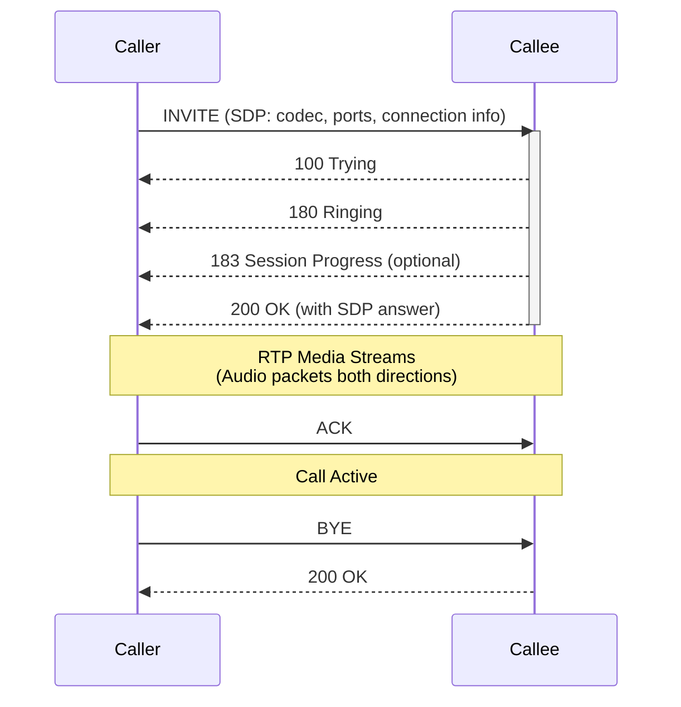
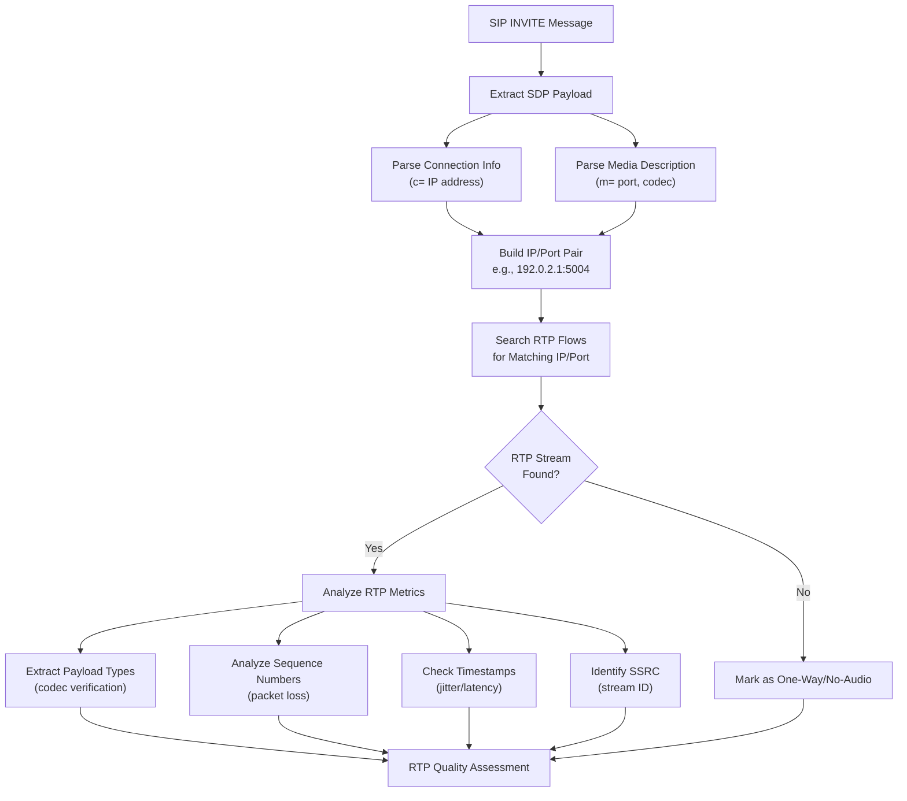
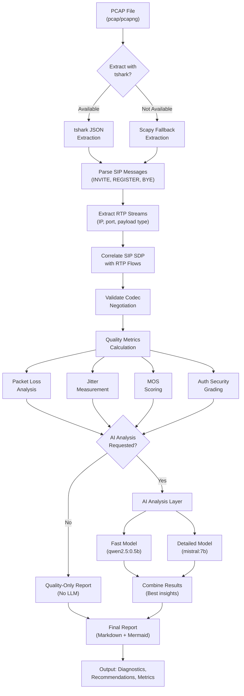

# SIP Analysis and Diagnostics Documentation

## Overview

This documentation covers SIP (Session Initiation Protocol) analysis and diagnostics in S.O.N.I.C. (SIP Observation and Network Inspection Console). S.O.N.I.C. is a comprehensive VoIP diagnostic tool that leverages AI to identify call quality issues, disconnection problems, and network-related problems from packet capture files.

## 📌 Current Tool: sonic.py

**S.O.N.I.C. v3.0** uses **sonic.py** as the official entry point for all SIP analysis and diagnostics.

```bash
# Recommended: Combined analysis
python3 sonic.py --file capture.pcapng --model combined --save_file report.md

# Fast quality check
python3 sonic.py --file capture.pcapng --quality-only --save_file report.md

# Detailed analysis
python3 sonic.py --file capture.pcapng --model detailed --save_file report.md
```

See [README.md](README.md) for complete usage documentation.

## 🔧 Core Capabilities

### SIP Diagnostic Analysis

**Primary Purpose**: AI-powered analysis of SIP packet captures to identify call quality issues, disconnection problems, and network-related VoIP issues.

**Key Features**:
- **Dual AI Model Analysis**: Combines fast structured output with detailed natural language insights
- **Comprehensive Issue Detection**: Identifies choppy audio, call disconnects, codec problems, network issues
- **Multi-Format Support**: Handles pcap and pcapng files with tshark and scapy fallback
- **Rich Output**: Enhanced display with emojis and structured reporting
- **Robust Error Handling**: Graceful degradation through multiple parsing strategies
- **Security Analysis**: Phase 3 auth security posture grading (A+ to F)

**Analysis Modes**:
- `combined` (recommended): Merges both models for optimal accuracy
- `fast`: Quick analysis with structured output  
- `detailed`: Comprehensive natural language analysis
- `quality-only`: No LLM, offline quality metrics only

**Supported Providers**:
- Ollama (local, recommended)
- Anthropic Claude  
- OpenAI GPT
- Azure OpenAI
- Quality-only (no LLM required)

### Batch Processing

For multiple files, use the shell loop pattern with sonic.py:

```bash
# Analyze all pcap files in directory
for file in /path/to/pcaps/*.pcap*; do
  python3 sonic.py --file "$file" --model combined --save_file "${file%.pcap*}_report.md"
done
```

## 🏗️ SIP Protocol Architecture

### SIP Message Flow



### SDP (Session Description Protocol)

Part of INVITE message payload - defines media characteristics:

```
v=0
o=user1 53655 846 IN IP4 192.0.2.1
s=-
c=IN IP4 192.0.2.1
t=0 0
m=audio 5004 RTP/AVP 0 101
a=rtpmap:0 PCMU/8000
a=rtpmap:101 telephone-event/8000
```

S.O.N.I.C. extracts and correlates:
- **Connection Info** (`c=IN IP4 192.0.2.1`): Media source IP
- **Media Description** (`m=audio 5004`): Port for RTP streams
- **Codec Negotiation** (`rtpmap`): Payload types and codecs
- **DTMF** (`telephone-event`): Out-of-band tone signaling

### RTP Stream Correlation

S.O.N.I.C. correlates RTP media with SIP signaling:



## 📊 Data Models

### SIP Diagnostic Report Structure

```python
SipDiagnosticReport {
    total_calls_analyzed: int              # Number of unique calls
    calls: List[CallDiagnostic]            # Individual call analyses
    overall_assessment: str                # High-level summary
    recommendations: List[str]             # Specific remediation steps
    analysis_method: str                   # Combined/Fast/Detailed
    quality_score: int                     # Overall MOS estimate
    auth_posture: AuthSecurityPosture      # Phase 3: A+ to F grade
}

CallDiagnostic {
    call_id: str                           # SIP Call-ID
    caller: str                            # From header / IP
    callee: str                            # To header / IP
    codec_used: str                        # Primary audio codec
    call_termination: str                  # How call ended (BYE, 486, etc)
    response_codes: List[str]              # SIP response codes
    audio_quality: AudioQualityMetrics
    network_issues: List[str]              # Identified problems
}

AudioQualityMetrics {
    codec: str                             # Audio codec (PCMU, G.729, etc)
    packet_loss: float                     # Percentage loss
    jitter: float                          # jitter in ms
    rtp_port: int                          # Media stream port
    quality_assessment: str                # Excellent/Good/Acceptable/Poor/Failed
}

AuthSecurityPosture {
    grade: str                             # A+ to F grade
    score: int                             # 0-100 numeric score
    realm: str                             # SIP authentication realm
    auth_methods: List[str]                # Digest, Basic, etc
    security_issues: List[str]             # Identified vulnerabilities
    recommendations: List[str]             # Upgrade suggestions
}
```

## 🚀 Analysis Workflow

### Data Extraction Pipeline



## 🔍 SIP Issues Detected

S.O.N.I.C. identifies the top 10 real-world VoIP problems:

### 1. Poor Call Quality
- **Detection**: RTP packet loss >1%, jitter >20ms
- **Indicators**: Choppy audio, muffled speech, garbled voice
- **Analysis**: Codec quality profiling, bandwidth assessment

### 2. Dropped Calls
- **Detection**: Premature SIP BYE, 4xx/5xx responses  
- **Indicators**: Calls suddenly disconnecting mid-conversation
- **Analysis**: Call termination patterns, response code tracking

### 3. One-Way or No Audio
- **Detection**: Asymmetric RTP flows, no RTP correlation with SDP
- **Indicators**: Audio flows only in one direction
- **Analysis**: SDP-RTP correlation, media port validation

### 4. Echo or Feedback
- **Detection**: RTP timestamp analysis, bidirectional timing correlation
- **Indicators**: Hearing own voice, audio loops
- **Analysis**: Echo cancellation assessment, latency measurement

### 5. Registration Failures
- **Detection**: REGISTER response codes, 401 Unauthorized tracking
- **Indicators**: SIP devices unable to register
- **Analysis**: Credential validation, realm analysis

### 6. NAT and Firewall Issues
- **Detection**: Private vs public IP analysis, Via header inspection
- **Indicators**: Connection problems behind routers, one-way audio
- **Analysis**: RTP port accessibility, contact header rewriting

### 7. Codec Mismatches
- **Detection**: SDP codec negotiation analysis, payload type validation
- **Indicators**: Garbled audio, no audio due to incompatibility
- **Analysis**: Multi-codec environment compatibility

### 8. Network Issues
- **Detection**: Packet loss >5%, jitter >50ms, latency measurement
- **Indicators**: Degraded voice, conversation delays
- **Analysis**: Congestion pattern analysis, threshold monitoring

### 9. Interoperability Problems
- **Detection**: User-Agent analysis, SIP method compatibility checking
- **Indicators**: Issues between different vendor equipment
- **Analysis**: Vendor detection, protocol variant checking

### 10. Security Vulnerabilities
- **Detection**: Unencrypted RTP, auth header validation, spoofing indicators
- **Indicators**: Eavesdropping risk, unauthorized access patterns
- **Analysis**: Phase 3 security posture grading, recommendations

## 🛠️ Performance Characteristics

### sonic.py Performance

| Analysis Mode | Speed | Accuracy | Use Case |
|---------------|-------|----------|----------|
| quality-only | <1s | Good | Offline, no API keys |
| fast | 0.01-4.6s | Good | Quick triage |
| detailed | 30+ seconds | Excellent | Deep investigation |
| combined | 20-35s | Excellent | Production use |

### RTP/SIP Correlation

- **SIP Message Parsing**: <100ms per call
- **RTP Stream Identification**: <200ms per media flow
- **Quality Metrics Calculation**: <500ms per call
- **Total Analysis**: Seconds for typical 10-call capture

## 📋 Prerequisites

### System Dependencies
```bash
# Ubuntu/Debian
sudo apt-get update
sudo apt-get install tshark python3-pip

# macOS
brew install wireshark python3

# Windows/WSL
# Install Wireshark from https://www.wireshark.org/
```

### Python Dependencies
```bash
pip install scapy dspy-ai pydantic ollama tqdm
```

### AI Backend (Optional)
```bash
# Install Ollama for local analysis
curl -fsSL https://ollama.com/install.sh | sh

# Pull recommended models
ollama pull qwen2.5:0.5b      # Fast model
ollama pull mistral:7b         # Detailed model
```

## 🔧 Installation & Setup

1. **Install System Dependencies** (see above)
2. **Install Python Packages**:
   ```bash
   pip install -r requirements.txt
   ```
3. **Verify Installation**:
   ```bash
   python3 sonic.py --help
   ```
4. **Test with Sample**:
   ```bash
   python3 sonic.py --file samples/MG-SIP-1.pcapng --quality-only
   ```

## 🔗 Deprecated Tools

The following tools are **deprecated as of v3.0** (March 2026). Use `sonic.py` for all VoIP analysis:

- **sip_test.py** → Use `sonic.py` instead
- **batch_test.py** → Use shell loop with `sonic.py` for multiple files
- **sip_server.py** → Out of v3.0 scope (SIP server, not analysis tool)
- **raw_test.py** → Protocol testing framework (not VoIP diagnostics)

These legacy entry points are documented for historical reference only. All new code should use the `sonic.py` interface.

## 📚 References

### RFC Standards
- **RFC 3261**: SIP Protocol Specification
- **RFC 2617**: HTTP Authentication (Digest Auth used in SIP)
- **RFC 3665**: SIP Basic Call Flow Examples
- **RFC 4733**: RTP Payload for DTMF Digits, Tone Signals, and Telephony Tones
- **RFC 3550**: RTP Protocol

### Tools & Frameworks
- **Wireshark/tshark**: Packet analysis and dissection
- **DSPy**: AI framework for language model integration
- **Ollama**: Local AI model hosting
- **scapy**: Python packet manipulation

## 📝 Version History

- **v3.0** (March 4, 2026): sonic.py as canonical entry point, deprecated legacy tools
- **v2.0** (January 13, 2025): Combined analysis, dual AI model support
- **v1.0** (2023): Initial diagnostic tool with AI integration

**Last Updated**: March 4, 2026  
**Author**: Raymond A Rizzo | Zombat  
**License**: MIT
